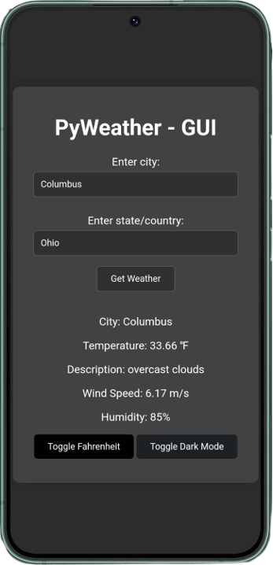

# PyWeather
PyWeather is a free and open-source piece of software that utilizes the OpenWeatherMap API to fetch weather information based on user input.
Now with a GUI! 

## Prerequisites  
Python

Requests (1.0 CLI)

Folium, pyqtwebengine, pyqt5 (2.0 & Up CLI)

# Screenshots





# Setup 1.0 - CLI
First install requests

```python
pip install requests
```
---
2.0 & Up

```python
pip install folium pyqtwebengine pyqt5
```
---
# CLI
Then simply create a API key from this [link](https://home.openweathermap.org/api_keys).

Paste it in @ line 38


---

# CLI 2.0 & Up

Create a API key from [here](https://home.openweathermap.org/api_keys)

Paste @ line 12


---

# Mobile Version: GUI

Create a API key from [here](https://home.openweathermap.org/api_keys)

Paste @ line 137


---

# Desktop Version: GUI

Create a API key from [here](https://home.openweathermap.org/api_keys)

Paste @ line 153


---


# Setup - GUI
1. Choose Your Web Server:

Flexibility: You have the freedom to use various web server clients, including SiPyWeb and nginx.
nginx on Windows: If you're using nginx on Windows, simply download the zip file from the releases, extract it, and run nginx.exe. It's that easy!

2. Start the Server:

No extra steps: Once you've chosen your web server, just fire it up and you're ready to go.
API Key:

Free public key: A free public API key is conveniently pre-installed, so you can start using the service right away.
Customization: If you prefer to use your own API key, you can easily create one at [openweathermap.org/appid](https://openweathermap.org/appid)
That's it! With these simple steps, you'll be up and running in no time.

# Don't want to use an API Key?
Get a release that already has one!

https://github.com/colebolebole/openweather/releases/tag/pyweather

